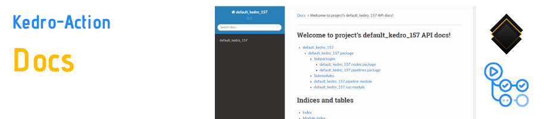
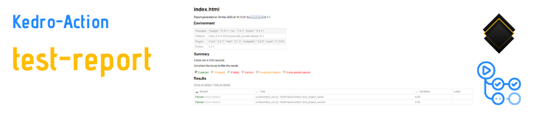

# 

A GitHub Action to `lint`, `test`, `build-docs`, `package`, `static-viz`, and `run` your [kedro](https://github.com/quantumblacklabs/kedro) pipelines. Supports any Python version you'll give it (that is also supported by [pyenv](https://github.com/pyenv/pyenv)). 

Inspired by [mariamrf/py-package-publish-action](https://github.com/mariamrf/py-package-publish-action) and [crazy-max/ghaction-github-pages](https://github.com/crazy-max/ghaction-github-pages).

# Example

Check out [WaylonWalker/default-kedro157](https://github.com/WaylonWalker/default-kedro157/) for a working example of the action.

[](https://default-kedro-157.waylonwalker.com/)

[](https://default-kedro-157-docs.netlify.com/)

[](https://default-kedro-157-test.netlify.com/)

# Use

## Pre-requisits

In order for the Action to have access to the code, you must use the actions/checkout@master job before it. See the example below.

For kedro-action to commit results back to the `kedro-action` branch you must supply a GitHub Personal Access Token through the secrets manager.  See [this link](https://help.github.com/en/github/authenticating-to-github/creating-a-personal-access-token-for-the-command-line) for more help.

## Inputs

* python_version:
    * description: a Python version that is supported by pyenv
    * default: '3.7.0'
* should_lint:
    * description: runs `kedro lint`
    * default: true
* should_test:
    * description: runs `kedro test`
    * default: true
* should_build_docs:
    * description: runs `kedro build-docs`
    * default: true
* should_package:
    * description: runs `kedro package`
    * default: true
* should_run:
    * description: runs `kedro run`
    * default: false
* should_viz:
    * description: creates a static site built on gatsby based on `kedro viz --save-pipeline pipeline.json`
    * default: true
* deploy_branch
   * branch to deploy static site to
   * default: kedro-action
* github_pat
   * description: github personal access token
   * for help: https://help.github.com/en/github/authenticating-to-github/creating-a-personal-access-token-for-the-command-line
   * default: null
* verbose
   * description: prints extra information for debugging
   * default: false

## Example Workflow

``` yaml
name: kedro

on:
  push:
    branches:
      - master

jobs:
  kedro:
    runs-on: ubuntu-latest
    steps:
    - uses: actions/checkout@master
    - name: Kedro
      uses: WaylonWalker/kedro-action@2.0.0
      with:
        GITHUB_PAT: ${{ secrets.GITHUB_PAT }} # required for push to kedro-action branch

